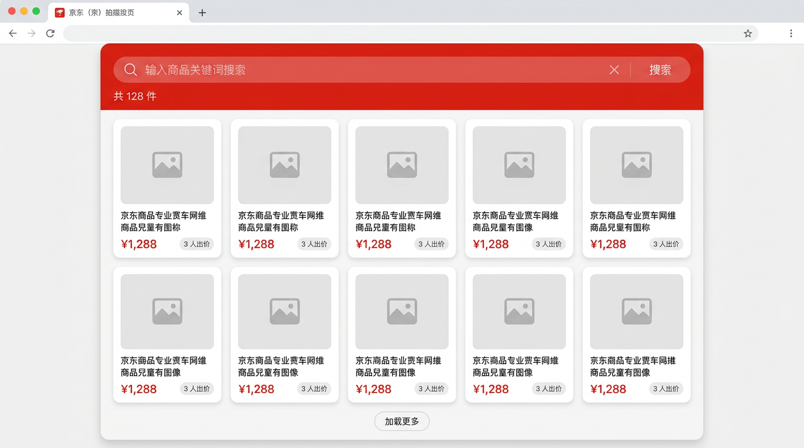
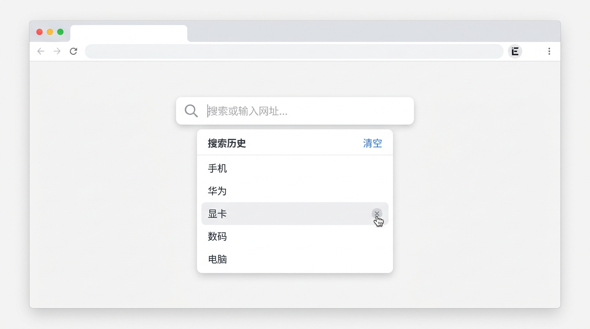
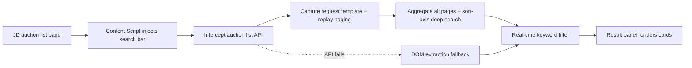

<p align="center">
  
</p>

# JD Auction Search Enhancer

<p align="center">
  <a href="./CHANGELOG.md"></a>
  <a href="./LICENSE"></a>
  
  
  
</p>

<p align="center">
  A browser extension that adds keyword search to the JD auction (Paipai) list page ·
  real-time filtering · cross-page aggregation · automatic fallback
</p>

<p align="center">
  <a href="./README.md">中文</a> · <a href="./CHANGELOG.md">Changelog</a> · <a href="./openspec/spec.md">Spec</a>
</p>

---

**How do I search JD auction items?** The native JD Paipai auction list
([1paipai.jd.com](https://1paipai.jd.com)) has no keyword search — you must flip through pages manually.
This extension injects a search bar into the list page: type a keyword and it
**aggregates across pages and filters in real time** — phones, Huawei, GPUs,
whatever you need, found instantly without paging.

---

## 📑 Table of Contents

- [Preview](#preview)
- [Get Started in 3 Steps](#get-started-in-3-steps-30-seconds)
- [Core Features](#core-features)
- [Usage](#usage)
- [Installation](#installation)
- [How It Works](#how-it-works)
- [FAQ](#faq)
- [Contributing](#contributing)
- [License](#license)

---

## Preview

| Search filtering | Search history | Empty state |
|------------------|----------------|-------------|
|  |  |  |

<details>
<summary>📐 UI structure (text)</summary>

**Search filtering**

```
Search bar: [ phone_______ ] ✕  Search   128 items
Grid:       [card][card][card][card][card]   ← 5 per row, red price + gray bid badge
            [card][card][card][card][card]
            (128 aggregated, still loading…)
```

**Search history**

```
Search bar: [ __________ ] ✕  Search
Dropdown:   Search history              Clear
            • phone
            • huawei
            • gpu                ×
            • digital            ×
```

**Empty state**

```
        🔍
    No matching products
  Try another keyword, or clear search to view all
        [ Clear search ]
```

</details>

---

## Get Started in 3 Steps (30 seconds)

1. **Install**: load this project as an unpacked extension in Chrome / Edge / Firefox (see [Installation](#installation)).
2. **Open**: open any JD auction list page; a search bar appears at the top automatically.
3. **Search**: type a keyword (e.g. `phone`, `Huawei`); results refresh **in real time** and overlay the page; click **×** to clear and restore the original list.

That's it — no page reload, no login required.

---

## Core Features

This extension fills the native gap of "search" on the JD auction (Paipai) list page, making huge catalogs instantly queryable:

- **🎯 Real-time keyword search**: filter instantly by product name, ID, category, shop, or subtitle — results appear as you type.
- **📚 Cross-page aggregation**: auto-pages through every auction page; results cover **all paginated items** — no manual paging.
- **🔍 Deep background search**: shows current results while continuing to search more pages in the background — each page is merged and the panel refreshes incrementally (hit count grows live); 20 pages per chunk, continuingly replayed until the last page (capped at 200 pages).
- **🧭 Sort-axis deep search**: auto-detects the list's sort parameter, replays other sort values after the default, and aggregates items only exposed under certain sort orders.
- **🛡 API fallback**: when the auction API is unavailable, automatically degrades to on-page DOM extraction so search never breaks.
- **🕘 Search history**: persists the last 10 keywords locally, kept across reloads; supports per-item delete and clear-all.
- **➕ Loading hint**: while aggregation is incomplete, a "(N aggregated, still loading)" hint appears after the toolbar count.
- **🌐 Multi-language**: Simplified Chinese / English UI, auto-switched by browser language.
- **🕒 Auction countdown**: the auction time shows at the top of each card; a client-side singleton timer ticks down every second, with red/yellow highlights for ending/starting countdowns and "Ended"/"Started" at zero.
- **🔒 Style isolation**: the search bar uses a Shadow DOM and the result panel uses design tokens, immune to JD's page CSS.

---

## Usage

Once the JD auction list page is open, the extension takes over the search experience with zero configuration:

| Step | Action | Effect |
|------|--------|--------|
| ① Search bar appears | Enter the auction list page, wait ~2s | A search bar is injected at the top automatically |
| ② Type a keyword | Enter a product name / ID / category / shop | Results filter **in real time**, aggregated across all pages |
| ③ View results | Result panel overlays the native list | Click a card to open detail in a **new tab**; more hits stream in live as background search continues |
| ④ Search history | Focus the empty search box | Shows a **history dropdown** (per-item delete / clear-all), kept across reloads |
| ⑤ Clear search | Click **×** on the right of the search box | Native auction list restores automatically, no reload |
| ⑥ No match | Nothing matches | Panel shows a "No matching products" empty state |

> While searching, the result panel (a fixed overlay) covers the native list — the native list stays alive, so it restores instantly on clear;
> the whole flow needs **no page reload and no login**.
> Keywords match multiple fields (name / ID / category / shop) — the more specific, the more precise.

---

## Installation

### 1. Prepare icons (optional)
Place 3 PNG icons in `icons/`: `icon16.png`, `icon48.png`, `icon128.png`.
Missing icons do not block loading.

### 2. Load into the browser
- **Chrome / Edge**: open `chrome://extensions/` → enable "Developer mode" →
  click "Load unpacked" → select this project folder.
- **Firefox**: open `about:debugging#/runtime/this-firefox` → click
  "Load Temporary Add-on" → select `manifest.json`.

> The extension ships a single package with Simplified Chinese (zh_CN) + English (en) only.

---

## How It Works



- **Zero backend**: a pure front-end MV3 extension — no server; all data comes from the current page.
- **API interception**: wraps `fetch` / `XHR`, captures the real list request as a template, and replays paging (with sort-axis deep search and chunked continuation) to aggregate items.
- **Graceful degradation**: automatically falls back to on-page DOM extraction when the API fails.
- **Style isolation**: the search bar uses a closed Shadow DOM; the result panel uses light DOM + design tokens to avoid JD's page CSS interference.

---

## FAQ

| Situation | Action |
|-----------|--------|
| Extension does nothing after page load | Refresh, or wait ~2s for auto-load |
| No results / API failure | Extension auto-degrades to on-page extraction |
| CORS interception | `host_permissions` is configured (covers `*.jd.com`); usually no action needed |

---

## Contributing

Issues and PRs are welcome. Development conventions:

- Code style follows ESLint (`.eslintrc.json`); run `npm run lint` before committing.
- Tests: `npm test` (i.e. `node scripts/smoke.js`, a jsdom full-flow smoke test with 108 assertions covering interception / i18n / price / security / DOM / deep-search / countdown, see `scripts/smoke.js`).
- Before releasing, sync all file-header versions with `node scripts/bump-version.js <new-version>`.

---

## License

[MIT License](./LICENSE)

---

### Keywords

JD auction search · Paipai search extension · JD auction item filter · browser
extension · Chrome extension · Edge add-on · Firefox add-on · cross-page
aggregation search · real-time filtering · deep background search
