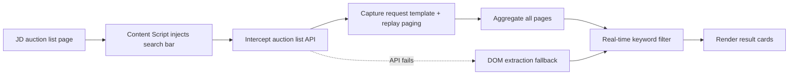

# JD Auction Search Enhancer

<p align="center">
  <a href="./CHANGELOG.md"></a>
  <a href="./LICENSE"></a>
  
  
  
</p>

<p align="center">
  A browser extension that adds keyword search to the JD auction (Paipai) list page ·
  real-time filtering · cross-page aggregation · automatic fallback
</p>

<p align="center">
  <a href="./README.md">中文</a> · <a href="./CHANGELOG.md">Changelog</a> · <a href="./openspec/spec.md">Spec</a>
</p>

---

**How do I search JD auction items?** The native JD Paipai auction list
([1paipai.jd.com](https://1paipai.jd.com)) has no keyword search — you must flip through pages manually.
This extension injects a search bar into the list page: type a keyword and it
**aggregates across pages and filters in real time** — phones, Huawei, GPUs,
whatever you need, found instantly without paging.

---

## 📑 Table of Contents

- [Preview](#preview)
- [Get Started in 3 Steps](#get-started-in-3-steps-30-seconds)
- [Usage](#usage)
- [Core Features](#core-features)
- [Installation](#installation)
- [Build & Release](#build--release)
- [How It Works](#how-it-works)
- [FAQ](#faq)
- [Contributing](#contributing)
- [License](#license)

---

## Preview

> 📷 Place screenshots in `docs/screenshots/` (`search.png` / `empty.png` / `history.png`),
> then replace the placeholders below. Current figures are ASCII previews.

<details open>
<summary><b>🔍 Search filtering</b></summary>

```
┌─────────────────────────────────────────────────────────────┐
│  Search  [ phone_______________ ]  ✕   Search  128 items     │
├─────────────────────────────────────────────────────────────┤
│  ┌──────┐ ┌──────┐ ┌──────┐ ┌──────┐ ┌──────┐               │
│  │[img] │ │[img] │ │[img] │ │[img] │ │[img] │               │
│  │Huawei│ │Apple │ │Xiaomi│ │OPPO  │ │vivo  │               │
│  │¥1,288│ │¥2,399│ │¥999  │ │¥1,599│ │¥1,199│               │
│  └──────┘ └──────┘ └──────┘ └──────┘ └──────┘               │
│            Load more (60 / 128 shown)                        │
└─────────────────────────────────────────────────────────────┘
```

</details>

<details>
<summary><b>🗂 Search history</b></summary>

```
┌──────────────────────────────────────┐
│  Search  [ __________ ]  ✕   Search     │
├──────────────────────────────────────┤
│ Search history                Clear    │
│ • phone                                 │
│ • huawei                                │
│ • gpu                          ×        │
│ • digital                      ×        │
└──────────────────────────────────────┘
```

</details>

---

## Get Started in 3 Steps (30 seconds)

1. **Install**: load this project as an unpacked extension in Chrome / Edge / Firefox (see [Installation](#installation)).
2. **Open**: open any JD auction list page; a search bar appears at the top automatically.
3. **Search**: type a keyword (e.g. `phone`, `Huawei`); results refresh **in real time** and overlay the page; click **×** to clear and restore the original list.

That's it — no page reload, no login required.

---

## Usage

Once the JD auction list page is open, the extension takes over the search experience:

| Step | Action | Effect |
|------|--------|--------|
| ① Search bar appears | Enter the auction list page, wait ~2s | A search bar is injected at the top automatically |
| ② Type a keyword | Enter a product name / ID / category / shop | Results filter **in real time**, aggregated across all pages |
| ③ View results | Result panel overlays the native list | Supports "load more"; click a card to open detail in a **new tab** |
| ④ Clear search | Click **×** on the right of the search box | Native auction list restores automatically, no reload |
| ⑤ No match | Nothing matches | Panel shows a "No matching products" empty state |

> The native list hides automatically while searching and restores on clear;
> no page reload is needed.
> Focusing the empty search box shows a **history dropdown** (delete per item or
> clear all), persisted across reloads.

---

## Core Features

- **🎯 Real-time keyword search**: filter instantly by product name, ID, category, shop, or subtitle.
- **📚 Cross-page aggregation**: auto-pages through every auction page; results cover all paginated items — no manual paging.
- **🛡 API fallback**: when the auction API is unavailable, automatically degrades to on-page DOM extraction so search never breaks.
- **🕘 Search history**: persists the last 10 keywords locally, kept across reloads.
- **🌐 Multi-language**: Simplified Chinese / English UI.

---

## Installation

### 1. Prepare icons (optional)
Place 3 PNG icons in `icons/`: `icon16.png`, `icon48.png`, `icon128.png`.
Missing icons do not block loading.

### 2. Load into the browser
- **Chrome / Edge**: open `chrome://extensions/` → enable "Developer mode" →
  click "Load unpacked" → select this project folder.
- **Firefox**: open `about:debugging#/runtime/this-firefox` → click
  "Load Temporary Add-on" → select `manifest.json`.

> For store publishing, package as a zip via `npm run build` (see [Build & Release](#build--release)).

---

## Build & Release

```bash
npm install
npm run build
```

This produces `jd-auction-search-v1.5.3.zip` in the project root, ready to publish.

Optional build flags:
- `node build.js --no-preview`: skip the build artifact preview

> Note: the extension ships a single package with Simplified Chinese (zh_CN) + English (en) only. The `--tw` / `--firefox` locale variant flags have been removed.

---

## How It Works



- **Zero backend**: a pure front-end MV3 extension — no server; all data comes from the current page.
- **API interception**: wraps `fetch` / `XHR`, captures the real list request as a template, and replays paging to aggregate items.
- **Graceful degradation**: automatically falls back to on-page DOM extraction when the API fails.
- **Style isolation**: the search bar uses a closed Shadow DOM; the result panel uses light DOM + design tokens to avoid JD's page CSS interference.

---

## FAQ

| Situation | Action |
|-----------|--------|
| Extension does nothing after page load | Refresh, or wait ~2s for auto-load |
| No results / API failure | Extension auto-degrades to on-page extraction |
| CORS interception | `host_permissions` is configured; usually no action needed |

---

## Contributing

Issues and PRs are welcome. Development conventions:

- Code style follows ESLint + Prettier; run `npm run lint` before committing.
- Tests: `npm test` (functional + integration).
- Build: `npm run build`.

---

## License

[MIT License](./LICENSE)

---

### Keywords

JD auction search · Paipai search extension · JD auction item filter · browser
extension · Chrome extension · Edge add-on · Firefox add-on · cross-page
aggregation search · real-time filtering
